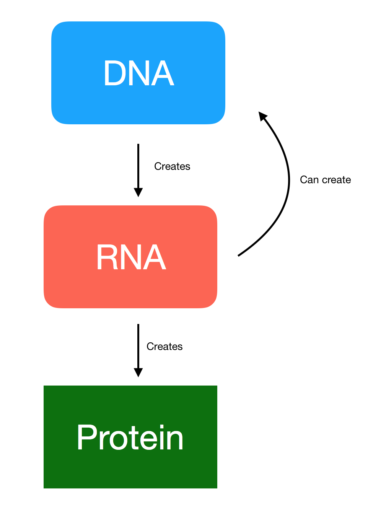

## Biology concepts

* Here are a few concepts that you simply need to memorize. 

#### Organizational hierarchy of complex organisms.

Organisms can be broadly defined into two types: Eukaryote and Prokaryote.  Eukaryote organisms are organisms that use multiple discrete steps when creating RNA and when creating proteins (see Splicing).  Prokaryote organisms are organisms that have only 1 step when creating RNA and protein.
Examples of Eukaryotes are humans, mice, rabbits, and algae.
Examples of Prokaryotes are **E. coli* bacteria and Streptococcus bacteria.

Viruses are neither prokaryotes nor eukaryotes, but **usually** behave like the organism that they infect.  For example, the Human Immunodeficiency Virus (HIV) creates RNA in the same way as Eukaryotes.

For Eukaryotes, the organizational structure can be defined as:
Cell -> Tissue -> Organ -> System -> Organism

1) Cells are units with discrete functions, but are part of a larger set that is defined as a tissue. (Example: epithelial cells are part of skin tissue)
2) Tissues are organizational units with discrete functions, but are part of a larger set that is defined as an organ. (Example: neuronal tissues are part of the spinal cord)
3) Organs are organizational units with discrete functions, but are part of a larger set that is defined as a system. (Example: the digestive system is composed of organs including the esophagus and stomach)
4) Systems are organizational units with discrete functions, and an organism is comprised of multiple systems. (Example: humans have multiple systems, including the Immune System and digestive system)

#### Fundamental Dogma of Biology

DNA <-> RNA -> Protein

All of the following are true regarding the Fundamental Dogma of Biology:
1) DNA creates DNA
2) DNA creates RNA
3) RNA can create DNA
4) RNA creates proteins

#### DNA

DNA can be described as a string containing 4 characters: A,T,C,G which are abbreviations for the nucleotides Adenosine, Thymine, Cytosine, and Guanine
Cells use DNA is a reference sequence to carry out lower-level functions, like creating RNA.

An example string of DNA would be:

AATTACCAAGGAA

Several activities that an organism uses with DNA are:
* Cells duplicate all DNA in cells when a cell is copied
* Cells can copy sections of DNA as part of a structured repair process
* Cells can use DNA to create RNA, while RNA carries out higher functions of the cell in response to internal and external stimuli to the cell.

DNA is always double-stranded, meaning a strand of DNA defined by string D = AATTCCGGAATT will also have a second string D1 = TTAAGGCCTTAA, which is defined by the complement for each nucleotide:

A <-> T

C <-> G

Most bioinformatics files only report one strand, since the complement string can easily be defined by:

        # bash
        printf($D) | tr 'ACTG' 'TGAC'

And the reverse-complement can be defined by:

        # bash
        printf($D) | rev | tr 'ACTG' 'TGAC'

#### RNA
RNA can be described as a string of 4 characters: A,U,C,G which are abbreviations for the nucleotides Adenosine, Uracil, Cytosine, and Guanine.
Cells use RNA as a template reference sequence to carry out mid- and higher-level functions, like creating proteins in response to internal and external stimuli.  

An example string of RNA would be:

AAUUCCGGAACCC

Note that RNA *never* has Thymine, abbreviated T.  
Several activities that an organism uses with RNA are:
* Cells create RNA in response to internal and external stimuli, while proteins carry out discrete tasks in the cell and external to the cell.
* Cells can create cDNA from RNA

RNA is *usually* single-stranded, but it may be double-stranded.

Also note that the creation of RNA from DNA is defined as transcription.

#### cDNA
cDNA, short for complementary DNA, is DNA that has been created from RNA using an cellular function called a reverse transcriptase enzyme.  Although it was created from RNA, cDNA will follow the structure for DNA, in that it will always have A,T,C,G 

cDNA is double-stranded.

#### protein
Protein in the cell can be described as a higher-level structural unit that is created from RNA, and will activate or deactivate functions in the cell.  It is created by the cell in response to any number of internal or external stimuli, including normal cell functions.

#### Splicing
Eukaryotes have more complexity than prokaryotes, and therefore have an additional process that takes place when RNA is transcribed (created from DNA), and when protein is translated (created from RNA).
Given a string S, comprised of substrings s1, s2, ..., sN, a larger string P will be comprised of at least 1 substring from s1, s2, ..., sN.
The ordering of the substringsis multidirectional, and may overlap with other substrings.

For example:
S    = AATTCCGGAACCTTAAGGAA
S_rc = TTAAGGCCTTGGAATTCCTT # reverse-complement of DNA string S
s1 = TTCCGG
s2 = GGAATT
s3 = ATTCC
P = TTCCGGGGAATTATTCC # spliced RNA

#### Selected Cell Functions

* enzymes: Enzymes are proteins that carry out specific tasks in the cell. All enzymes have the suffix 'ase' in their name, such as reverse transcriptase, which converts RNA to cDNA.  

* apoptosis: A function in a cell that can be initiated internally or externally, that causes a cell to stop functioning and die in an orderly and defined manner.

## Glossary

**cDNA:** complementary DNA ; DNA that has been created from RNA.  

**DNA:** Deoxy Ribonucleic Acid

**Fundamental Dogma of Biology:** DNA <-> RNA -> Protein

**RNA:** Ribonucleic Acid ; created from DNA, and used to create proteins in response to internal stimuli, external stimuli, and functions in the cell.

**Protein:** building blocks that the cell uses.  Created from RNA, and used to activate or deactivate functions that a cell can perform

**transcription:** creating RNA from DNA

**translation:** creating proteins from RNA
